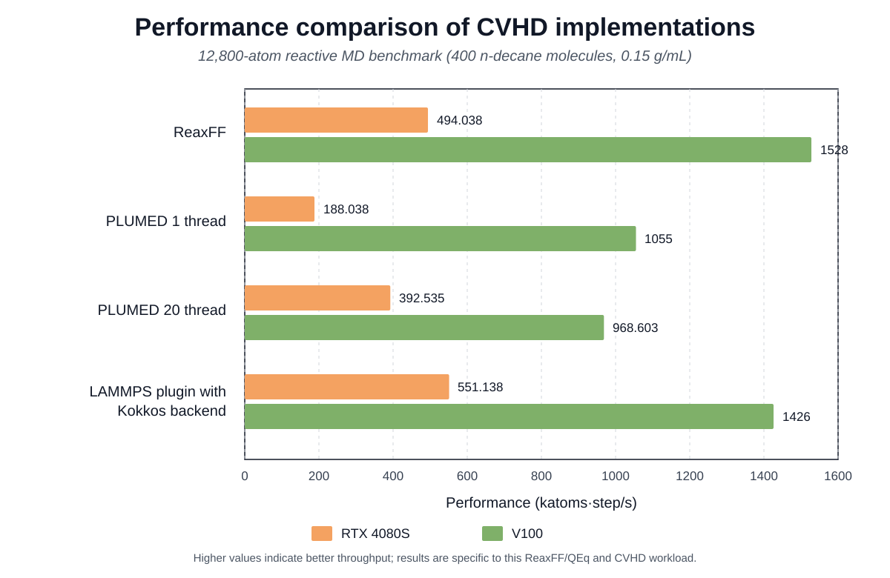

# LAMMPS OPES_CVHD Kokkos plugin: V3s-cleanup

This directory contains the cleaned V3s production/profiling baseline for
`fix cvhd/global/distortion/kk`.

## What changed relative to V3s-hstate

The physics/state-machine logic is unchanged:

- event-local C-C breaking and C-C formation candidate updates;
- C-C ambiguous-state exclusion for breaking and formation channels;
- H-level C-H state tracking with `h_event_set_`;
- Kokkos device neighbor-list collection for C-C formation events;
- Kokkos fused CV/force kernels.

Cleanup changes:

- removed the heavy ambiguous-pair and event-pair debug output paths;
- removed obsolete reset-diff helper functions left from earlier prototypes;
- simplified the default config file for production/profiling;
- replaced obsolete `cc_break_events` / `cc_form_events` output columns with
  current state counters.

## Main output columns

`cvhd_v3s_cleanup.colvar` now writes:

```text
step time ccbb chbb ccbf cv1 cv2 bias
n_cc_bonds n_ch_bonds n_cc_form_candidates
n_amb_cc n_amb_ch n_h_event
cvhd_events cvhd_wait
opes_nker opes_sigma_cv1 opes_sigma_cv2 opes_rct opes_neff opes_prob
opes_raw_bias opes_barrier opes_ct_slope opes_stable_windows opes_dE
opes_damp_bias opes_boost
```

The previous debug outputs `cvhd_ambiguous_pairs.dat` and
`cvhd_event_pairs.dat` are intentionally not generated by this cleanup version.
Use V3r/V3s-hstate if pair-level event diagnostics are needed.

## Performance benchmark



The benchmark used the same initial structure, input file, and 20,000-step
trajectory for all cases:

- system: 400 n-decane molecules (12,800 atoms), density 0.15 g/mL;
- ReaxFF baseline: CVHD was not loaded;
- PLUMED 1 thread: the original PLUMED implementation with one thread;
- PLUMED 20 thread: `PLUMED_NUM_THREADS=20`;
- Kokkos plugin: 1 MPI rank × 1 OpenMP thread × 1 GPU;
- throughput is reported in katoms·step/s; higher values indicate better performance.

| Implementation | RTX 4080S | V100 |
|---|---:|---:|
| ReaxFF baseline | 494.038 | 1528 |
| PLUMED 1 thread | 188.038 | 1055 |
| PLUMED 20 thread | 392.535 | 968.603 |
| LAMMPS plugin with Kokkos backend | 551.138 | 1426 |

The feature sets are not identical: the Kokkos plugin evaluates C-C and C-H
bond breaking **and C-C bond formation**, whereas the original PLUMED
implementation used in this benchmark does not include the C-C formation
channel. The benchmark should therefore be interpreted as a practical
throughput comparison for the present ReaxFF/QEq workload, not as a universal
GPU ranking.

### Current reaction-output limitation

A 200-million-step production trajectory at 1500 K for the same 400-molecule,
0.15 g/mL system was successfully post-processed with ChemTraYzer2. However,
the offline reaction analysis required a full bond-connectivity trajectory of
approximately 231 GB. This is currently an I/O limitation rather than a CVHD
plugin limitation. A future online or delta-topology reaction logger would
allow reaction events to be written directly without retaining the full bond
trajectory.

## Recommended profiling workflow

Run the same input for short segments with:

```text
cvhd_timer_enable = 1
cvhd_timer_stride = 20000
```

and compare against no-CVHD / `bias_enable = 0` controls. For long production
runs, keep:

```text
cvhd_timer_enable = 0
cc_connectivity_update = 0
h_event_scan_enable = 1
```

## Files

- `fix_cvhd_global_distortion.cpp/.h`: host-side OPES_CVHD state machine and OPES logic.
- `fix_cvhd_global_distortion_kokkos.cpp/.h`: Kokkos reductions, fused neighbor kernels, and device pair caches.
- `cvhd_global_distortion_plugin.cpp`: LAMMPS plugin registration.
- `cvhd_global_distortion_v3s_cleanup.cfg`: default production/profiling configuration.
- `Makefile`, `CMakeLists.txt`: example build files; adjust LAMMPS/Kokkos include paths locally.

## Patch note

This archive includes the `build_initial_ambiguous_pairs()` definition required by `setup()`; the first cleanup archive accidentally left this method declared/called but undefined.
